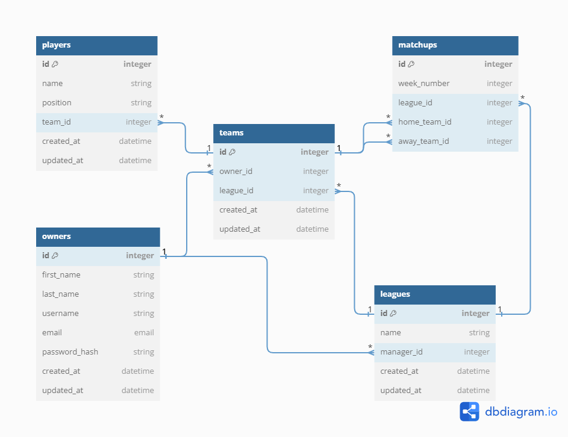

# Fantasy Premier League

A Robust Fantasy Premier League Application built on a Flask/Python Server & utilizing a React Frontend.

<!-- <s>Jump directly to the deployed application here: [fantasy-eleven]().</s> **-- Temporarily unavailable! --** -->

---

## Installation

1. Fork and clone this repo from Github to your local environment
2. Navigate into your local directory and open the contents in your preferred code editor
3. Run `pipenv install` to install dependencies
4. Run `pipenv shell` to create virtual environment
5. From the main project directory, run `cd server` to enter the server directory

### Set up .env file

6. Create `.env` file in the server directory with `touch .env`
7. Add a line for `SECRET_KEY=`
8. In your terminal, run `python -c 'import secrets; print(secrets.token_hex())` to generate your own key
9. Copy the result into the `.env` file as the value for the secret key
10. Make sure `.env` is added to your `.gitignore`
11. Add a line for `DATABASE_URI=`
12. Copy the link to the external database you would like to connect. If you are using Render, start the link with `postgresql://` -- **not** just `postgres://`. You can find full instructions [here](https://render.com/docs/databases#connecting-from-outside-render).

### Configuring the database

18. `export FLASK_APP=app.py`
19. `flask db init`
20. `flask db upgrade head`
21. Run `python seed.py` to seed the database

### Starting the client

22. In another terminal, `cd` into the client directory
23. Run `npm install` to install dependencies
24. Run `npm start` to open the app in the browser

### Starting the app

25. Once you've installed all client and server dependencies, you can also run the app in one terminal from the main directory: `gunicorn --chdir server app:app`

---

## Licensing

MIT License
Copyright (c) 2023

## References and Acknowledgements

[API-Football](https://www.api-football.com/documentation-v3) 
[RapidAPI-sports](https://rapidapi.com/api-sports/api/api-football/) 
[Securing your session key](https://morgvanny.com/securing-your-session-key-in-flask/) 
[Create a Flask application with Google Login](https://realpython.com/flask-google-login/)
